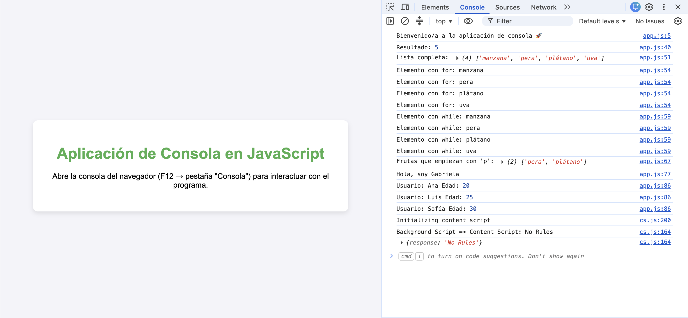
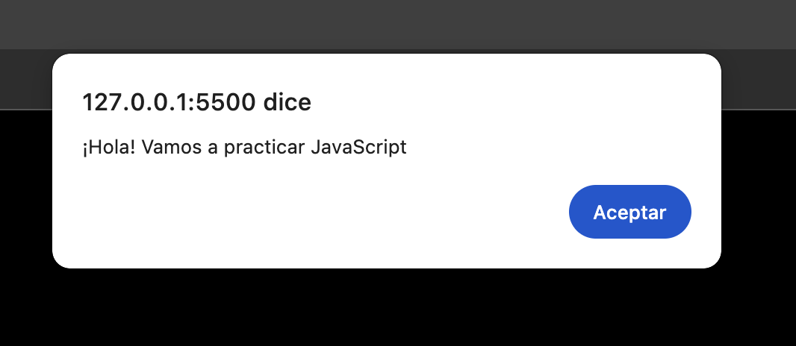
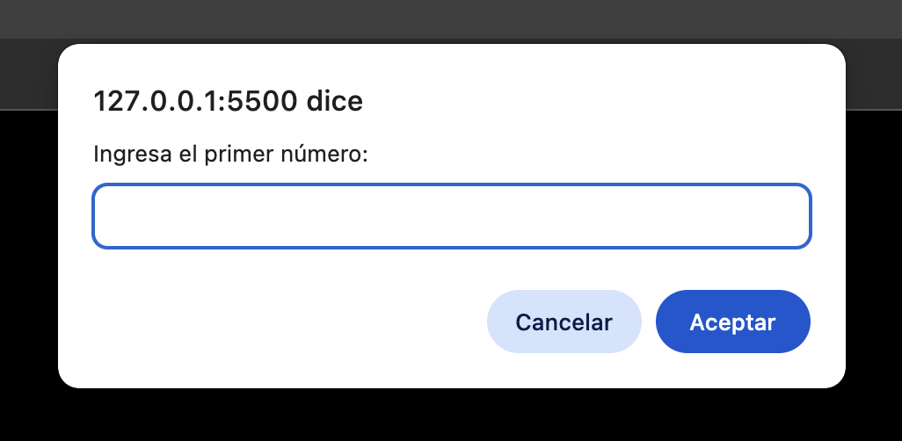
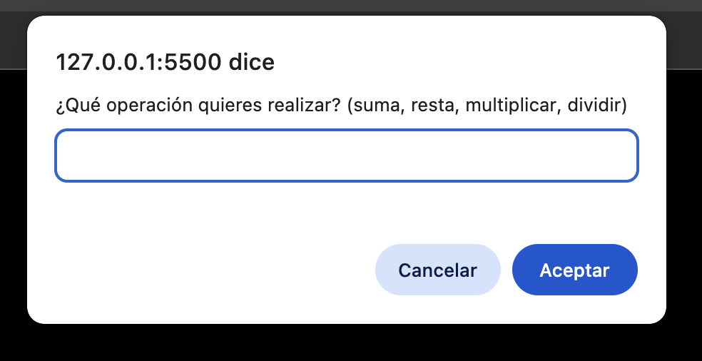

# Proyecto Módulo 4 – Aplicación de Consola en JavaScript

## 📖 Descripción
Este proyecto corresponde a la evaluación del Módulo 4 del curso.  
La aplicación permite interactuar con funciones básicas de JavaScript directamente desde la **consola del navegador**.

## 🚀 Uso
1. Abre el archivo `index.html` en tu navegador.
2. Presiona **F12** y selecciona la pestaña **Consola**.
3. Sigue las instrucciones que aparecen en la consola para probar las funciones.

## 🛠️ Funcionalidades
- Mensajes básicos con `console.log` y `alert`.
- Solicitud de datos mediante `prompt()`.
- Funciones matemáticas: sumar, restar, multiplicar y dividir.
- Condicionales con `switch`.
- Arreglos y ciclos (`for`, `while`).
- Objetos y arreglos de usuarios.

## 🎨 Estilos
La página incluye estilos básicos en CSS:
- Contenido centrado vertical y horizontalmente.
- Caja con fondo blanco, sombra y bordes redondeados.
- Tipografía clara y legible.

## 🌐 Repositorio
El proyecto está publicado en GitHub:  
👉 [Ver repositorio](https://github.com/gdiazcontreras/evaluacion-m4)

## 🚀 Deployment
El proyecto está desplegado en GitHub Pages:  
👉 [Ver aplicación](https://gdiazcontreras.github.io/evaluacion-m4)

## 📸 Capturas
- Página principal.

- Ejemplo de interacción en la consola.

## 👩‍💻 Autora
Proyecto realizado por **Gabriela Díaz Contreras**.

## 🤖 Apoyo con IA
Durante el desarrollo de este proyecto utilicé herramientas de Inteligencia Artificial (Copilot y Gemini) como apoyo para:
- Revisar errores de lógica en el código.
- Ordenar y estructurar mejor las funciones y archivos.
- Revisar el proyecto siguiendo los parámetros entregados en la consigna.
- Crear y dar forma al archivo README.md.

El trabajo final y las decisiones de implementación fueron realizadas por mí, utilizando la IA como guía y apoyo en el proceso.